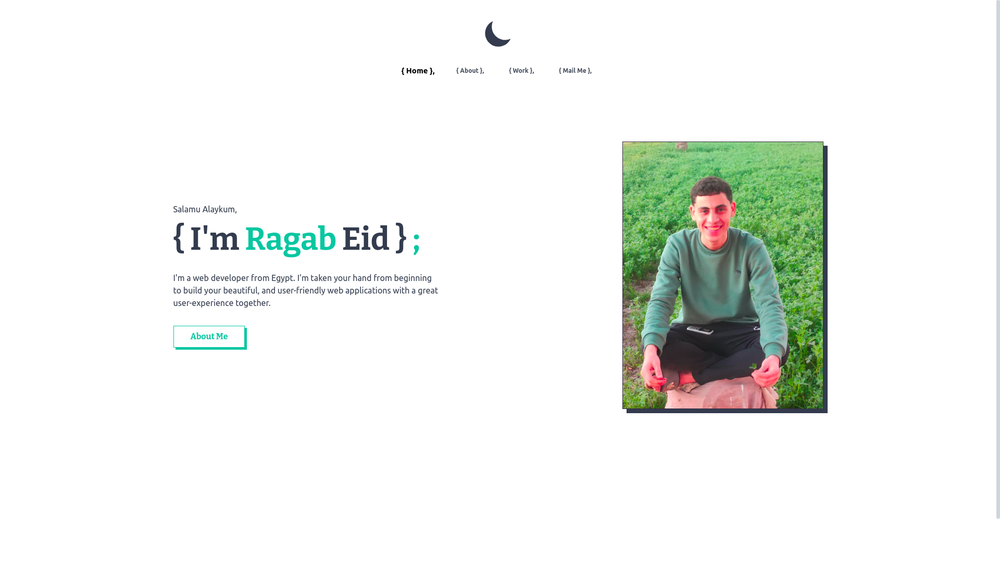
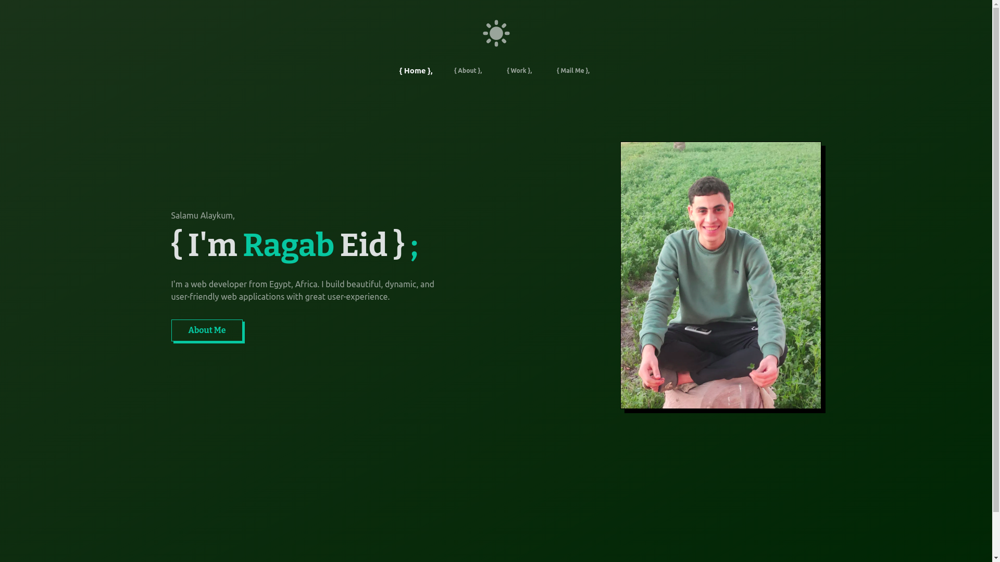

# Welcome

This is My personla portfolio - **ragab-portfolio** - where i showcase all my skills, experience, work, some of my projects and simplest apps that i was practice and appling on.

## My Goals
- Building something that can present me or speaks about me, using my field - web field
- Learning new skills, techologies and using new tools as I'm continuously learning and building new different projects and putting them on the portfolio. and that is why it took me about 3 months in building :)
- To easily reach for different opportunities..
- Finally to fulfil my obligation about the front-end web development field as I am a front-end web developer :) a must as i believe :)

## Techologies and tools

- HTML5
- CSS3
- JavaScript
- JSON
- React
- Nextjs
- Tailwindcss
- Vercel

## View at
- [Link1](https://ragab.vercel.app/) or https://ragab.vercel.app/
- [Link2](https://ragab-eid.vercel.app/) or https://ragab-eid.vercel.app/
- [Link3](https://ragab-website.vercel.app/) or https://ragab-website.vercel.app/
- [Link4](https://ragab-portfolio-ragab0.vercel.app/) or https://ragab-portfolio-ragab0.vercel.app/
- [Link5](https://ragab-portfolio-git-main-ragab0.vercel.app/) or https://ragab-portfolio-git-main-ragab0.vercel.app/

***Take what you like, they all working (may be) - 
They are so many because they are free :DD :))***